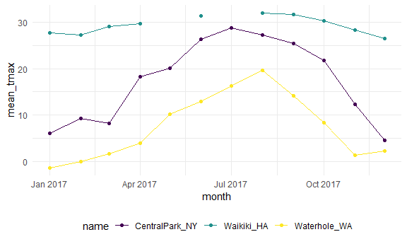

exploratory numeric analysis
================
Jiayi Shi
2022-10-05

``` r
library(tidyverse)

Sys.setlocale("LC_TIME", "English")

knitr::opts_chunk$set(
  fig.width = 6,
  fig.asp = .6,
  out.width = "90%"
)

theme_set(theme_minimal() + theme(legend.position = "bottom"))

options(
  ggplot2.continuous.colour = "viridis",
  ggplot2.continuous.fill = "viridis"
)

scale_colour_discrete = scale_colour_viridis_d
scale_fill_discrete = scale_fill_viridis_d
```

``` r
weather_df =  
  rnoaa::meteo_pull_monitors(
    c("USW00094728", "USC00519397", "USS0023B17S"),
    var = c("PRCP", "TMIN", "TMAX"), 
    date_min = "2017-01-01",
    date_max = "2017-12-31") %>%
  mutate(
    name = recode(
      id, 
      USW00094728 = "CentralPark_NY", 
      USC00519397 = "Waikiki_HA",
      USS0023B17S = "Waterhole_WA"),
    tmin = tmin / 10,
    tmax = tmax / 10,
    month = lubridate::floor_date(date, unit = "month")) %>%
  # 2012-01-13 rounded to minth: 2012-01-01
  select(name, id, everything())
```

## `group_by`+`summarise()`

`group_by`: don’t change any of the data, just add a layer on top of the
data set, change the behavior of functions used it.

``` r
weather_df %>% 
  group_by(name, month) 
```

    ## # A tibble: 1,095 × 7
    ## # Groups:   name, month [36]
    ##    name           id          date        prcp  tmax  tmin month     
    ##    <chr>          <chr>       <date>     <dbl> <dbl> <dbl> <date>    
    ##  1 CentralPark_NY USW00094728 2017-01-01     0   8.9   4.4 2017-01-01
    ##  2 CentralPark_NY USW00094728 2017-01-02    53   5     2.8 2017-01-01
    ##  3 CentralPark_NY USW00094728 2017-01-03   147   6.1   3.9 2017-01-01
    ##  4 CentralPark_NY USW00094728 2017-01-04     0  11.1   1.1 2017-01-01
    ##  5 CentralPark_NY USW00094728 2017-01-05     0   1.1  -2.7 2017-01-01
    ##  6 CentralPark_NY USW00094728 2017-01-06    13   0.6  -3.8 2017-01-01
    ##  7 CentralPark_NY USW00094728 2017-01-07    81  -3.2  -6.6 2017-01-01
    ##  8 CentralPark_NY USW00094728 2017-01-08     0  -3.8  -8.8 2017-01-01
    ##  9 CentralPark_NY USW00094728 2017-01-09     0  -4.9  -9.9 2017-01-01
    ## 10 CentralPark_NY USW00094728 2017-01-10     0   7.8  -6   2017-01-01
    ## # … with 1,085 more rows

### Counting things

- `group_by`+`summarise(n())`

``` r
weather_df %>% 
  group_by(name, month) %>% # can group by more than one variable
  summarise(n_obs = n())
```

    ## `summarise()` has grouped output by 'name'. You can override using the
    ## `.groups` argument.

    ## # A tibble: 36 × 3
    ## # Groups:   name [3]
    ##    name           month      n_obs
    ##    <chr>          <date>     <int>
    ##  1 CentralPark_NY 2017-01-01    31
    ##  2 CentralPark_NY 2017-02-01    28
    ##  3 CentralPark_NY 2017-03-01    31
    ##  4 CentralPark_NY 2017-04-01    30
    ##  5 CentralPark_NY 2017-05-01    31
    ##  6 CentralPark_NY 2017-06-01    30
    ##  7 CentralPark_NY 2017-07-01    31
    ##  8 CentralPark_NY 2017-08-01    31
    ##  9 CentralPark_NY 2017-09-01    30
    ## 10 CentralPark_NY 2017-10-01    31
    ## # … with 26 more rows

- `count()`

``` r
weather_df %>% 
  count(name,month,name = "n_obs")#the count column name, default to be "n"
```

    ## # A tibble: 36 × 3
    ##    name           month      n_obs
    ##    <chr>          <date>     <int>
    ##  1 CentralPark_NY 2017-01-01    31
    ##  2 CentralPark_NY 2017-02-01    28
    ##  3 CentralPark_NY 2017-03-01    31
    ##  4 CentralPark_NY 2017-04-01    30
    ##  5 CentralPark_NY 2017-05-01    31
    ##  6 CentralPark_NY 2017-06-01    30
    ##  7 CentralPark_NY 2017-07-01    31
    ##  8 CentralPark_NY 2017-08-01    31
    ##  9 CentralPark_NY 2017-09-01    30
    ## 10 CentralPark_NY 2017-10-01    31
    ## # … with 26 more rows

- don’t use `table`

``` r
weather_df %>%
  pull(month) %>% 
  table
```

    ## .
    ## 2017-01-01 2017-02-01 2017-03-01 2017-04-01 2017-05-01 2017-06-01 2017-07-01 
    ##         93         84         93         90         93         90         93 
    ## 2017-08-01 2017-09-01 2017-10-01 2017-11-01 2017-12-01 
    ##         93         90         93         90         93

- multiple summaries

``` r
weather_df %>%
  group_by(month) %>%
  summarize(
    n_obs = n(),
    n_days = n_distinct(date))
```

    ## # A tibble: 12 × 3
    ##    month      n_obs n_days
    ##    <date>     <int>  <int>
    ##  1 2017-01-01    93     31
    ##  2 2017-02-01    84     28
    ##  3 2017-03-01    93     31
    ##  4 2017-04-01    90     30
    ##  5 2017-05-01    93     31
    ##  6 2017-06-01    90     30
    ##  7 2017-07-01    93     31
    ##  8 2017-08-01    93     31
    ##  9 2017-09-01    90     30
    ## 10 2017-10-01    93     31
    ## 11 2017-11-01    90     30
    ## 12 2017-12-01    93     31

### 2x2 tables

Tabulate the frequency of a binary outcome across levels of a binary
predictor.

- \``group_by` + `summarise` + `pivot_wider`

``` r
weather_df %>%
  mutate(
    cold = case_when(
      tmax>=5 ~ "not_cold",# condition ~ output value
      tmax<5 ~ "cold",
      TRUE ~ "" # force case_when to output value behind TRUE if none of the previous conditions were TRUE
    ) 
  ) %>% 
  filter(name != "Waikiki_HA") %>% 
  group_by(name,cold) %>% 
  summarise(count = n()) %>% 
  pivot_wider(names_from = "cold",values_from = "count")
```

    ## `summarise()` has grouped output by 'name'. You can override using the
    ## `.groups` argument.

    ## # A tibble: 2 × 3
    ## # Groups:   name [2]
    ##   name            cold not_cold
    ##   <chr>          <int>    <int>
    ## 1 CentralPark_NY    44      321
    ## 2 Waterhole_WA     172      193

``` r
 # convert to a nice 2x2 table
```

- `knitr::ktable()`: table for Rmarkdown file – Presenting
  reader-friendly results for this kind of exploratory analysis. (use
  pivot_wider to untidy data so that reader-friendly)

``` r
weather_df %>%
  group_by(name, month) %>%
  summarize(mean_tmax = mean(tmax)) %>% 
  pivot_wider(
    names_from = name,
    values_from = mean_tmax) %>% 
  knitr::kable(digits = 1) # digits: decimal place of output values in the table
```

    ## `summarise()` has grouped output by 'name'. You can override using the
    ## `.groups` argument.

| month      | CentralPark_NY | Waikiki_HA | Waterhole_WA |
|:-----------|---------------:|-----------:|-------------:|
| 2017-01-01 |            6.0 |       27.8 |         -1.4 |
| 2017-02-01 |            9.3 |       27.2 |          0.0 |
| 2017-03-01 |            8.2 |       29.1 |          1.7 |
| 2017-04-01 |           18.3 |       29.7 |          3.9 |
| 2017-05-01 |           20.1 |         NA |         10.1 |
| 2017-06-01 |           26.3 |       31.3 |         12.9 |
| 2017-07-01 |           28.7 |         NA |         16.3 |
| 2017-08-01 |           27.2 |       32.0 |         19.6 |
| 2017-09-01 |           25.4 |       31.7 |         14.2 |
| 2017-10-01 |           21.8 |       30.3 |          8.3 |
| 2017-11-01 |           12.3 |       28.4 |          1.4 |
| 2017-12-01 |            4.5 |       26.5 |          2.2 |

- janitor::tabyl (generate frequency table)

``` r
weather_df %>% 
  mutate(cold = case_when(
    tmax <  5 ~ "cold",
    tmax >= 5 ~ "not_cold",
    TRUE     ~ ""
  )) %>% 
  filter(name != "Waikiki_HA") %>% 
  janitor::tabyl(name, cold)
```

    ##            name cold not_cold
    ##  CentralPark_NY   44      321
    ##    Waterhole_WA  172      193

### functions in `summaries()`

``` r
weather_df %>%
  group_by(month) %>%
  summarize(
    mean_tmax = mean(tmax),
    mean_prec = mean(prcp, na.rm = TRUE),
    median_tmax = median(tmax),
    sd_tmax = sd(tmax))
```

    ## # A tibble: 12 × 5
    ##    month      mean_tmax mean_prec median_tmax sd_tmax
    ##    <date>         <dbl>     <dbl>       <dbl>   <dbl>
    ##  1 2017-01-01      10.8     37.0          6.1   13.1 
    ##  2 2017-02-01      12.2     57.9          8.3   12.1 
    ##  3 2017-03-01      13.0     54.6          8.3   12.4 
    ##  4 2017-04-01      17.3     32.9         18.3   11.2 
    ##  5 2017-05-01      NA       28.4         NA     NA   
    ##  6 2017-06-01      23.5     18.7         27.2    8.73
    ##  7 2017-07-01      NA       12.7         NA     NA   
    ##  8 2017-08-01      26.3     10.2         27.2    5.87
    ##  9 2017-09-01      23.8      9.94        26.1    8.42
    ## 10 2017-10-01      20.1     41.5         22.2    9.75
    ## 11 2017-11-01      14.0     61.5         12.0   11.6 
    ## 12 2017-12-01      11.0     40.2          8.9   11.9

- `across()`

Used to summarize multiple columns using the same summary.

``` r
weather_df %>%
  #group_by(name, month) %>%
  summarize(across(tmin:prcp, mean, na.rm=T))
```

    ## # A tibble: 1 × 3
    ##    tmin  tmax  prcp
    ##   <dbl> <dbl> <dbl>
    ## 1  10.2  18.1  33.7

### Plot

``` r
weather_df %>% 
  group_by(name,month) %>% 
  summarise(mean_tmax = mean(tmax)) %>% 
  # prepare the dataframe before plotting
  
  ggplot(aes(x = month, y = mean_tmax, color = name)) + 
  geom_point() +
  geom_path()
```

    ## `summarise()` has grouped output by 'name'. You can override using the
    ## `.groups` argument.

    ## Warning: Removed 2 rows containing missing values (geom_point).



## `group_by`+`mutate()`

To compare the daily max temperature to the annual average max
temperature for each station separately and plot the results.

``` r
weather_df %>%
  group_by(name) %>%
  mutate(
    mean_tmax = mean(tmax, na.rm = TRUE),
    centered_tmax = tmax - mean_tmax) %>% 
  ggplot(aes(x = date, y = centered_tmax, color = name)) + 
    geom_point() 
```

    ## Warning: Removed 3 rows containing missing values (geom_point).


### Window functions

aggregate funcitons: n inputs, 1 output  
window functions: n inputs, n outputs

- `min_rank()`

``` r
weather_df %>%
  group_by(name, month) %>%
  mutate(temp_ranking = min_rank(tmax)) # min_rank(): one way of ranking 
```

    ## # A tibble: 1,095 × 8
    ## # Groups:   name, month [36]
    ##    name           id          date        prcp  tmax  tmin month      temp_ran…¹
    ##    <chr>          <chr>       <date>     <dbl> <dbl> <dbl> <date>          <int>
    ##  1 CentralPark_NY USW00094728 2017-01-01     0   8.9   4.4 2017-01-01         22
    ##  2 CentralPark_NY USW00094728 2017-01-02    53   5     2.8 2017-01-01         12
    ##  3 CentralPark_NY USW00094728 2017-01-03   147   6.1   3.9 2017-01-01         15
    ##  4 CentralPark_NY USW00094728 2017-01-04     0  11.1   1.1 2017-01-01         27
    ##  5 CentralPark_NY USW00094728 2017-01-05     0   1.1  -2.7 2017-01-01          5
    ##  6 CentralPark_NY USW00094728 2017-01-06    13   0.6  -3.8 2017-01-01          4
    ##  7 CentralPark_NY USW00094728 2017-01-07    81  -3.2  -6.6 2017-01-01          3
    ##  8 CentralPark_NY USW00094728 2017-01-08     0  -3.8  -8.8 2017-01-01          2
    ##  9 CentralPark_NY USW00094728 2017-01-09     0  -4.9  -9.9 2017-01-01          1
    ## 10 CentralPark_NY USW00094728 2017-01-10     0   7.8  -6   2017-01-01         21
    ## # … with 1,085 more rows, and abbreviated variable name ¹​temp_ranking

Useful when filtering data based on rank:

``` r
weather_df %>%
  group_by(name, month) %>%
  filter(min_rank(tmax) < 2)
```

    ## # A tibble: 42 × 7
    ## # Groups:   name, month [36]
    ##    name           id          date        prcp  tmax  tmin month     
    ##    <chr>          <chr>       <date>     <dbl> <dbl> <dbl> <date>    
    ##  1 CentralPark_NY USW00094728 2017-01-09     0  -4.9  -9.9 2017-01-01
    ##  2 CentralPark_NY USW00094728 2017-02-10     0   0    -7.1 2017-02-01
    ##  3 CentralPark_NY USW00094728 2017-03-15     0  -3.2  -6.6 2017-03-01
    ##  4 CentralPark_NY USW00094728 2017-04-01     0   8.9   2.8 2017-04-01
    ##  5 CentralPark_NY USW00094728 2017-05-13   409  11.7   7.2 2017-05-01
    ##  6 CentralPark_NY USW00094728 2017-06-06    15  14.4  11.1 2017-06-01
    ##  7 CentralPark_NY USW00094728 2017-07-25     0  21.7  16.7 2017-07-01
    ##  8 CentralPark_NY USW00094728 2017-08-29    74  20    16.1 2017-08-01
    ##  9 CentralPark_NY USW00094728 2017-09-30     0  18.9  12.2 2017-09-01
    ## 10 CentralPark_NY USW00094728 2017-10-31     0  13.9   7.2 2017-10-01
    ## # … with 32 more rows

``` r
# keep only the day with the lowest max temperature within each month
```

``` r
weather_df %>%
  group_by(name, month) %>%
  filter(min_rank(desc(tmax)) < 4)
```

    ## # A tibble: 149 × 7
    ## # Groups:   name, month [36]
    ##    name           id          date        prcp  tmax  tmin month     
    ##    <chr>          <chr>       <date>     <dbl> <dbl> <dbl> <date>    
    ##  1 CentralPark_NY USW00094728 2017-01-12    13  18.9   8.3 2017-01-01
    ##  2 CentralPark_NY USW00094728 2017-01-13     0  16.7   0   2017-01-01
    ##  3 CentralPark_NY USW00094728 2017-01-26     5  13.3   6.1 2017-01-01
    ##  4 CentralPark_NY USW00094728 2017-02-19     0  18.3  11.7 2017-02-01
    ##  5 CentralPark_NY USW00094728 2017-02-23     0  18.3   6.7 2017-02-01
    ##  6 CentralPark_NY USW00094728 2017-02-24     0  21.1  14.4 2017-02-01
    ##  7 CentralPark_NY USW00094728 2017-03-01    30  21.1  12.2 2017-03-01
    ##  8 CentralPark_NY USW00094728 2017-03-02     0  17.8   1.7 2017-03-01
    ##  9 CentralPark_NY USW00094728 2017-03-25     3  16.7   5.6 2017-03-01
    ## 10 CentralPark_NY USW00094728 2017-04-16     0  30.6  15   2017-04-01
    ## # … with 139 more rows

``` r
# keep the three days with the highest max temperature
```

- `lag()` used to compare an observation to it’s previous value:

``` r
weather_df %>%
  group_by(name) %>%
  mutate(
    yesterday_tmax = lag(tmax) # default lag one day; should group_by first
  )
```

    ## # A tibble: 1,095 × 8
    ## # Groups:   name [3]
    ##    name           id          date        prcp  tmax  tmin month      yesterda…¹
    ##    <chr>          <chr>       <date>     <dbl> <dbl> <dbl> <date>          <dbl>
    ##  1 CentralPark_NY USW00094728 2017-01-01     0   8.9   4.4 2017-01-01       NA  
    ##  2 CentralPark_NY USW00094728 2017-01-02    53   5     2.8 2017-01-01        8.9
    ##  3 CentralPark_NY USW00094728 2017-01-03   147   6.1   3.9 2017-01-01        5  
    ##  4 CentralPark_NY USW00094728 2017-01-04     0  11.1   1.1 2017-01-01        6.1
    ##  5 CentralPark_NY USW00094728 2017-01-05     0   1.1  -2.7 2017-01-01       11.1
    ##  6 CentralPark_NY USW00094728 2017-01-06    13   0.6  -3.8 2017-01-01        1.1
    ##  7 CentralPark_NY USW00094728 2017-01-07    81  -3.2  -6.6 2017-01-01        0.6
    ##  8 CentralPark_NY USW00094728 2017-01-08     0  -3.8  -8.8 2017-01-01       -3.2
    ##  9 CentralPark_NY USW00094728 2017-01-09     0  -4.9  -9.9 2017-01-01       -3.8
    ## 10 CentralPark_NY USW00094728 2017-01-10     0   7.8  -6   2017-01-01       -4.9
    ## # … with 1,085 more rows, and abbreviated variable name ¹​yesterday_tmax

``` r
weather_df %>%
  group_by(name) %>%
  mutate(temp_change = tmax - lag(tmax))
```

    ## # A tibble: 1,095 × 8
    ## # Groups:   name [3]
    ##    name           id          date        prcp  tmax  tmin month      temp_cha…¹
    ##    <chr>          <chr>       <date>     <dbl> <dbl> <dbl> <date>          <dbl>
    ##  1 CentralPark_NY USW00094728 2017-01-01     0   8.9   4.4 2017-01-01     NA    
    ##  2 CentralPark_NY USW00094728 2017-01-02    53   5     2.8 2017-01-01     -3.9  
    ##  3 CentralPark_NY USW00094728 2017-01-03   147   6.1   3.9 2017-01-01      1.1  
    ##  4 CentralPark_NY USW00094728 2017-01-04     0  11.1   1.1 2017-01-01      5    
    ##  5 CentralPark_NY USW00094728 2017-01-05     0   1.1  -2.7 2017-01-01    -10    
    ##  6 CentralPark_NY USW00094728 2017-01-06    13   0.6  -3.8 2017-01-01     -0.5  
    ##  7 CentralPark_NY USW00094728 2017-01-07    81  -3.2  -6.6 2017-01-01     -3.8  
    ##  8 CentralPark_NY USW00094728 2017-01-08     0  -3.8  -8.8 2017-01-01     -0.600
    ##  9 CentralPark_NY USW00094728 2017-01-09     0  -4.9  -9.9 2017-01-01     -1.10 
    ## 10 CentralPark_NY USW00094728 2017-01-10     0   7.8  -6   2017-01-01     12.7  
    ## # … with 1,085 more rows, and abbreviated variable name ¹​temp_change

``` r
# find the day-by-day change in max temperature within each station over the year
```

This kind of variable might be used to quantify the day-by-day
variability in max temperature, or to identify the largest one-day
increase:

``` r
weather_df %>%
  group_by(name) %>%
  mutate(temp_change = tmax - lag(tmax)) %>%
  summarize(
    temp_change_sd = sd(temp_change, na.rm = TRUE),
    temp_change_max = max(temp_change, na.rm = TRUE))
```

    ## # A tibble: 3 × 3
    ##   name           temp_change_sd temp_change_max
    ##   <chr>                   <dbl>           <dbl>
    ## 1 CentralPark_NY           4.45            12.7
    ## 2 Waikiki_HA               1.23             6.7
    ## 3 Waterhole_WA             3.13             8

## Assessment

``` r
pulse = haven::read_sas("data/public_pulse_data.sas7bdat") %>%
  janitor::clean_names() %>% 
  pivot_longer(
    4:7,
    names_to = "visit",
    names_prefix = "bdi_score_",
    values_to = "bdi",
  ) %>% 
  select(id,visit,everything()) %>% 
  mutate(
    visit = recode(visit,"bl"="00m"),
    visit = factor(visit,levels = str_c(c("00","01","06","12"),"m"))
    #visit = as.factor(visit)
  ) %>% 
  arrange(id,visit)

pulse %>% 
  group_by(visit) %>% 
  summarise(mean_bdi = mean(bdi, na.rm = T),
            median_bdi = median(bdi, na.rm = T)) %>% 
  knitr::kable(digits = 2)
```

| visit | mean_bdi | median_bdi |
|:------|---------:|-----------:|
| 00m   |     7.99 |          6 |
| 01m   |     6.05 |          4 |
| 06m   |     5.67 |          4 |
| 12m   |     6.10 |          4 |

``` r
pup_data = 
  read_csv("./data/FAS_pups.csv") %>%
  janitor::clean_names() %>%
  mutate(sex = recode(sex, `1` = "male", `2` = "female")) 
```

    ## Rows: 313 Columns: 6
    ## ── Column specification ────────────────────────────────────────────────────────
    ## Delimiter: ","
    ## chr (1): Litter Number
    ## dbl (5): Sex, PD ears, PD eyes, PD pivot, PD walk
    ## 
    ## ℹ Use `spec()` to retrieve the full column specification for this data.
    ## ℹ Specify the column types or set `show_col_types = FALSE` to quiet this message.

``` r
litter_data = 
  read_csv("./data/FAS_litters.csv") %>%
  janitor::clean_names() %>%
  separate(group, into = c("dose", "day_of_tx"), sep = 3)
```

    ## Rows: 49 Columns: 8
    ## ── Column specification ────────────────────────────────────────────────────────
    ## Delimiter: ","
    ## chr (2): Group, Litter Number
    ## dbl (6): GD0 weight, GD18 weight, GD of Birth, Pups born alive, Pups dead @ ...
    ## 
    ## ℹ Use `spec()` to retrieve the full column specification for this data.
    ## ℹ Specify the column types or set `show_col_types = FALSE` to quiet this message.

``` r
fas_data = left_join(pup_data, litter_data, by = "litter_number")

fas_data %>% 
  group_by(dose, day_of_tx) %>% 
  drop_na(dose) %>% 
  summarize(mean_pivot = mean(pd_pivot, na.rm = TRUE)) %>% 
  pivot_wider(
    names_from = dose, 
    values_from = mean_pivot) %>% 
  knitr::kable(digits = 3)
```

    ## `summarise()` has grouped output by 'dose'. You can override using the
    ## `.groups` argument.

| day_of_tx |   Con |   Low |   Mod |
|:----------|------:|------:|------:|
| 7         | 7.000 | 7.939 | 6.984 |
| 8         | 6.236 | 7.721 | 7.042 |
