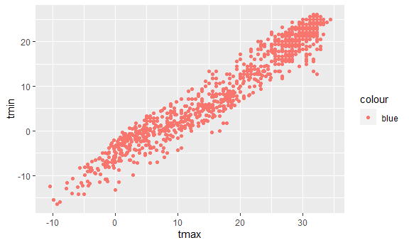
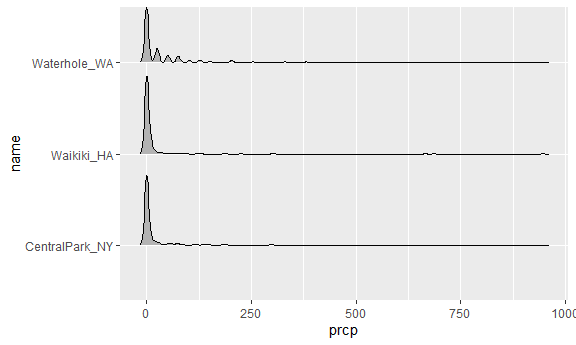

viz_and_eda
================
Jiayi Shi
2022-09-29

``` r
knitr::opts_chunk$set(
  fig.width = 6,
  fig.asp = .6, # aspect ratio (纵横比)
  out.width = "90%" 
  # control the size of the figure inserted into your document
  # 90%: have a little padding around the sides of my figures
)
```

``` r
library(tidyverse)
library(ggridges)
```

## Import data

``` r
weather_df = 
  rnoaa::meteo_pull_monitors(
    c("USW00094728", "USC00519397", "USS0023B17S"),
    var = c("PRCP", "TMIN", "TMAX"), 
    date_min = "2017-01-01",
    date_max = "2017-12-31") %>%
  mutate(
    name = recode(
      id, 
      USW00094728 = "CentralPark_NY", 
      USC00519397 = "Waikiki_HA",
      USS0023B17S = "Waterhole_WA"),
    tmin = tmin / 10,
    tmax = tmax / 10) %>%
  select(name, id, everything())
```

    ## Registered S3 method overwritten by 'hoardr':
    ##   method           from
    ##   print.cache_info httr

    ## using cached file: C:\Users\sjy99\AppData\Local/Cache/R/noaa_ghcnd/USW00094728.dly

    ## date created (size, mb): 2022-09-29 10:32:27 (8.418)

    ## file min/max dates: 1869-01-01 / 2022-09-30

    ## using cached file: C:\Users\sjy99\AppData\Local/Cache/R/noaa_ghcnd/USC00519397.dly

    ## date created (size, mb): 2022-09-29 10:32:47 (1.703)

    ## file min/max dates: 1965-01-01 / 2020-03-31

    ## using cached file: C:\Users\sjy99\AppData\Local/Cache/R/noaa_ghcnd/USS0023B17S.dly

    ## date created (size, mb): 2022-09-29 10:32:58 (0.952)

    ## file min/max dates: 1999-09-01 / 2022-09-30

## Scatterplot

``` r
ggplot(weather_df,aes(x = tmin, y = tmax)) +
# define dataset and the aesthetic mapping
  geom_point()
```

    ## Warning: Removed 15 rows containing missing values (geom_point).


- want to do some pre-processing of the dataset before making your plot
  but don’t want to save the intermediate data.

``` r
weather_df %>% 
  drop_na() %>% # thus getting rid of warning
  ggplot(aes(x = tmin, y = tmax)) +
  geom_point()
```


- can also save the output of ggplot() to an object and modify / print
  it later.

``` r
plot_weather = 
  weather_df %>%
  ggplot(aes(x = tmin, y = tmax)) 

plot_weather + geom_point()
```

    ## Warning: Removed 15 rows containing missing values (geom_point).


## Advanced scatterplot

``` r
weather_df %>% 
  ggplot(aes(x = tmin, y = tmax, color = name)) + # mapping a variable `color` onto an aesthetic
  geom_point() +
  geom_smooth() # mapping of color onto name is applying both to scatterplot and smooth curve
```

    ## `geom_smooth()` using method = 'loess' and formula 'y ~ x'

    ## Warning: Removed 15 rows containing non-finite values (stat_smooth).

    ## Warning: Removed 15 rows containing missing values (geom_point).


``` r
weather_df %>% 
  ggplot(aes(x = tmin, y = tmax)) + 
  geom_point(aes(color = name), alpha = .5) + # stack up different geometrics
  # mapping of color onto name is applying only to scatterplot
  # the transparency shows where data are overlapping
  geom_smooth(se = FALSE)# remove error bar
```

    ## `geom_smooth()` using method = 'gam' and formula 'y ~ s(x, bs = "cs")'

    ## Warning: Removed 15 rows containing non-finite values (stat_smooth).

    ## Warning: Removed 15 rows containing missing values (geom_point).


- make separate panels \`

``` r
weather_df %>% 
  ggplot(aes(x = tmin, y = tmax, color = name)) + 
  geom_point(alpha = .5) + 
  geom_smooth(se = FALSE) +
  facet_grid(. ~name) # add facet based on name
```

    ## `geom_smooth()` using method = 'loess' and formula 'y ~ x'

    ## Warning: Removed 15 rows containing non-finite values (stat_smooth).

    ## Warning: Removed 15 rows containing missing values (geom_point).


``` r
# facet_grid(name ~ .) row ~ col
```

``` r
ggplot(weather_df, aes(x = date, y = tmax, color = name)) + 
  geom_point(aes(size = prcp), alpha = .5) +
  geom_smooth(se = FALSE) + 
  facet_grid(. ~ name)
```

    ## `geom_smooth()` using method = 'loess' and formula 'y ~ x'

    ## Warning: Removed 3 rows containing non-finite values (stat_smooth).

    ## Warning: Removed 3 rows containing missing values (geom_point).


### Assessment

``` r
weather_df %>% 
  filter(name == "CentralPark_NY") %>% 
  mutate(tmax_fahr = tmax*1.8+32,
         tmin_fahr = tmin*1.8+32) %>% # concert temperature from Celsius to Fahrenheit
  ggplot(aes(x = tmin_fahr, y = tmax_fahr))+
  geom_point() + # scatterplot
  geom_smooth(method = "lm",se=F) # overlay a regression line 
```

    ## `geom_smooth()` using formula 'y ~ x'


## Odds and ends

When you’re making a scatterplot with lots of data, there’s a limit to
how much you can avoid overplotting using alpha levels and transparency.
In these cases geom_hex(), geom_bin2d(), or geom_density2d() can be
handy.

``` r
ggplot(weather_df, aes(x = tmax, y = tmin)) + 
  geom_hex() # hexagon fill to show 
```

    ## Warning: Removed 15 rows containing non-finite values (stat_binhex).


``` r
ggplot(weather_df, aes(x = tmax, y = tmin)) + 
  geom_density2d() # hexagon fill to avoid overlapping
```

    ## Warning: Removed 15 rows containing non-finite values (stat_density2d).


### Difference

``` r
ggplot(weather_df) + geom_point(aes(x = tmax, y = tmin), color = "blue")
```

    ## Warning: Removed 15 rows containing missing values (geom_point).



``` r
ggplot(weather_df) + geom_point(aes(x = tmax, y = tmin, color = "blue"))
```

    ## Warning: Removed 15 rows containing missing values (geom_point).


### Univariate plots (only x)

Histogram:

``` r
ggplot(weather_df, aes(x = tmax)) + 
  geom_histogram()
```

    ## `stat_bin()` using `bins = 30`. Pick better value with `binwidth`.

    ## Warning: Removed 3 rows containing non-finite values (stat_bin).


``` r
ggplot(weather_df, aes(x = tmax, fill = name)) + 
  geom_histogram(position = "dodge", binwidth = 2) # places the bars for each group side-by-side
```

    ## Warning: Removed 3 rows containing non-finite values (stat_bin).


Density:

``` r
ggplot(weather_df, aes(x = tmax, fill = name)) + 
  geom_density(alpha = .4, adjust = .5, color = "blue")+
  geom_rug()
```

    ## Warning: Removed 3 rows containing non-finite values (stat_density).


### (x&y)

Boxplot:

``` r
ggplot(weather_df, aes(x = name, y = tmax)) + geom_boxplot()
```

    ## Warning: Removed 3 rows containing non-finite values (stat_boxplot).


Violin plot:

``` r
ggplot(weather_df, aes(x = name, y = tmax)) + 
  geom_violin(aes(fill = name), alpha = .5) + 
  stat_summary(fun = "median", color = "blue")
```

    ## Warning: Removed 3 rows containing non-finite values (stat_ydensity).

    ## Warning: Removed 3 rows containing non-finite values (stat_summary).

    ## Warning: Removed 3 rows containing missing values (geom_segment).


Ridghe plot:

it is nice if you have lots of categories in which the shape of the
distribution matters.

``` r
ggplot(weather_df, aes(x = tmax, y = name)) + 
  geom_density_ridges(scale = 0.85) # scale: A value of 1 indicates that the maximum point of any ridgeline touches the baseline right above, assuming even spacing between baselines.
```

    ## Picking joint bandwidth of 1.84

    ## Warning: Removed 3 rows containing non-finite values (stat_density_ridges).


### Assessment

``` r
ggplot(weather_df,aes(x = prcp)) +
  geom_density(aes(fill = name),alpha = .5)
```

    ## Warning: Removed 3 rows containing non-finite values (stat_density).



``` r
ggplot(weather_df, aes(x = prcp, y = name)) + 
  geom_density_ridges(scale = .85)
```

    ## Picking joint bandwidth of 4.61

    ## Warning: Removed 3 rows containing non-finite values (stat_density_ridges).


``` r
ggplot(weather_df,aes(y = prcp, x = name)) + geom_boxplot()
```

    ## Warning: Removed 3 rows containing non-finite values (stat_boxplot).


Adjust the highly skewed distribution above if the “bulk” of the data
were interesting. (filter data)

``` r
weather_df %>% 
  filter(prcp >0) %>% 
  ggplot(aes(x = prcp, y = name)) + 
  geom_density_ridges(scale = .85)
```

    ## Picking joint bandwidth of 19.7


## Save plot `ggsave()`

``` r
weather_plot = ggplot(weather_df, aes(x = tmin, y = tmax)) + 
  geom_point(aes(color = name), alpha = .5) 

ggsave("weather_plot.pdf", weather_plot, width = 8, height = 5)
```

    ## Warning: Removed 15 rows containing missing values (geom_point).
