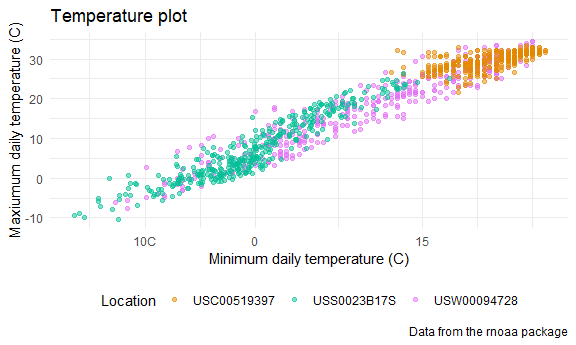
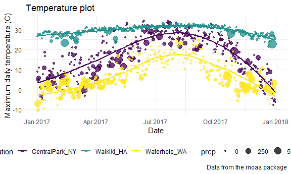
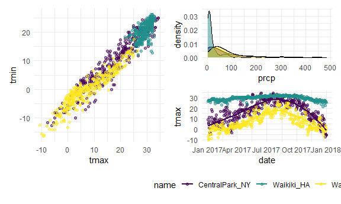
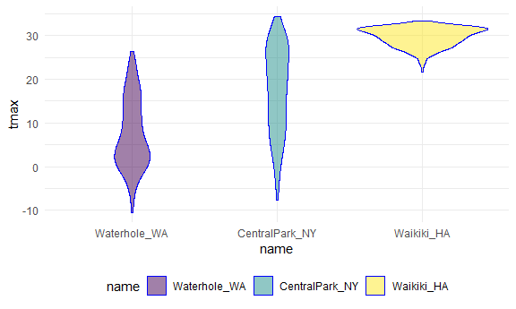
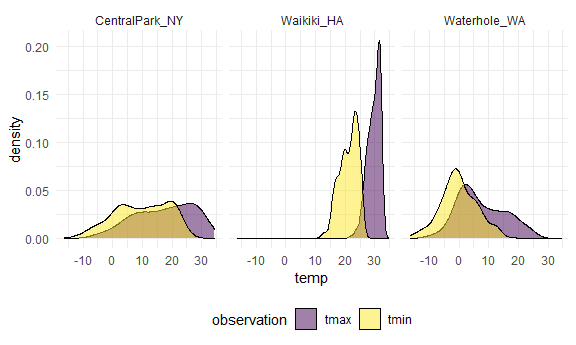
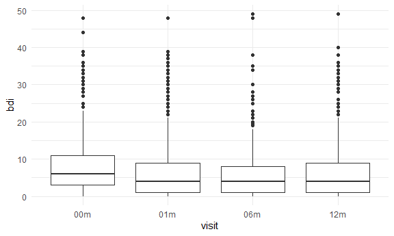
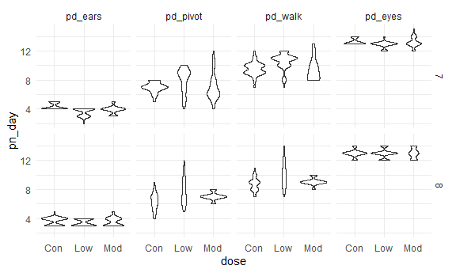

viz_2
================
Jiayi Shi
2022-10-04

``` r
weather_df = 
  rnoaa::meteo_pull_monitors(
    c("USW00094728", "USC00519397", "USS0023B17S"),
    var = c("PRCP", "TMIN", "TMAX"), 
    date_min = "2017-01-01",
    date_max = "2017-12-31") %>%
  mutate(
    name = recode(
      id, 
      USW00094728 = "CentralPark_NY", 
      USC00519397 = "Waikiki_HA",
      USS0023B17S = "Waterhole_WA"),
    tmin = tmin / 10,
    tmax = tmax / 10) %>%
  select(name, id, everything())
```

    ## Registered S3 method overwritten by 'hoardr':
    ##   method           from
    ##   print.cache_info httr

    ## using cached file: C:\Users\sjy99\AppData\Local/Cache/R/noaa_ghcnd/USW00094728.dly

    ## date created (size, mb): 2022-09-29 10:32:27 (8.418)

    ## file min/max dates: 1869-01-01 / 2022-09-30

    ## using cached file: C:\Users\sjy99\AppData\Local/Cache/R/noaa_ghcnd/USC00519397.dly

    ## date created (size, mb): 2022-09-29 10:32:47 (1.703)

    ## file min/max dates: 1965-01-01 / 2020-03-31

    ## using cached file: C:\Users\sjy99\AppData\Local/Cache/R/noaa_ghcnd/USS0023B17S.dly

    ## date created (size, mb): 2022-09-29 10:32:58 (0.952)

    ## file min/max dates: 1999-09-01 / 2022-09-30

## labs, scale

``` r
weather_df %>% 
  ggplot(aes(x = tmin, y = tmax)) + 
  geom_point(aes(color = id), alpha = .5) + 
# ggplot(aes(x = tmin, y = tmax, color = id)) + 
# geom_point(alpha = .5) + 
  labs(
    title = "Temperature plot",
    x = "Minimum daily temperature (C)",
    y = "Maxiumum daily temperature (C)",
    caption = "Data from the rnoaa package"
  ) +
  scale_x_continuous(
    breaks = c(-10,0,15),
    labels = c("10C","0","15")
  ) +
  scale_color_hue( # change point color / or use viridis::scale_color_viridis 
    name = "Location",# name: change legend name 
    h = c(40,300))
```

    ## Warning: Removed 15 rows containing missing values (geom_point).



## Themes

The ordering of theme_bw() and theme() matters – theme() changes a
particular element of the plot’s current “theme”.
theme_minimal()/bw()…they set parameters in a very specific way.

### Assessment

``` r
ggplot(weather_df,aes(x = date, y = tmax, color = name)) +
  geom_point(aes(size = prcp), alpha = .75) +
  geom_smooth(se = F) +
  labs(
    title = "Temperature plot",
    x = "Date",
    y = "Maximum daily temperature (C)",
    caption = "Data from the rnoaa package"
    ) +
  viridis::scale_color_viridis(
    name = "Location", # legend name
    discrete = TRUE) + # default: apply continuous scale
# discrete = TRUE: because the color aesthetic is mapped to a discrete variable. In other cases (for example, when color mapped to prcp) you can omit this argument to get a continuous color gradient. The viridis::scale_fill_viridis() function is appropriate for the fill aesthetic used in histograms, density plots, and elsewhere.
  theme_minimal()+
  theme(legend.position = "bottom") # legend.position = "none" will remove the legend. This is helpful when multiple plots use the same color scheme or when the legend is obnoxious for some other reason.
```

    ## `geom_smooth()` using method = 'loess' and formula 'y ~ x'

    ## Warning: Removed 3 rows containing non-finite values (stat_smooth).

    ## Warning: Removed 3 rows containing missing values (geom_point).



- Prepare all the dataset you need to plot first.

``` r
central_park = 
  weather_df %>% 
  filter(name == "CentralPark_NY")

waikiki = 
  weather_df %>% 
  filter(name == "Waikiki_HA")

ggplot(data = waikiki, aes(x = date, y = tmax, color = name)) + 
  geom_point() + 
  geom_line(data = central_park)
```

    ## Warning: Removed 3 rows containing missing values (geom_point).


## `patchwork`

To show two or three fundamentally different plots in the same graphic,
we can create each of the panels we want separately and combine panels
using tools in the patchwork package.

``` r
tmax_tmin_p = 
  weather_df %>% 
  ggplot(aes(x = tmax, y = tmin, color = name)) + 
  geom_point(alpha = .5) +
  theme(legend.position = "none")

prcp_dens_p = 
  weather_df %>% 
  filter(prcp > 0, prcp<500) %>% 
  ggplot(aes(x = prcp, fill = name)) + 
  geom_density(alpha = .5) + 
  theme(legend.position = "none")

tmax_date_p = 
  weather_df %>% 
  ggplot(aes(x = date, y = tmax, color = name)) + 
  geom_point(alpha = .5) +
  geom_smooth(se = FALSE) + 
  theme(legend.position = "bottom")

tmax_tmin_p + prcp_dens_p / tmax_date_p
```

    ## Warning: Removed 15 rows containing missing values (geom_point).

    ## `geom_smooth()` using method = 'loess' and formula 'y ~ x'

    ## Warning: Removed 3 rows containing non-finite values (stat_smooth).

    ## Warning: Removed 3 rows containing missing values (geom_point).



## Data manipulation

change order of categorical variables.  
convert to factor, default is alphabetical ordering.  
`fct_relevel`: based on your own preference.  
`fct_reorder`: based on another variable.

``` r
weather_df %>%
  #mutate(name = forcats::fct_relevel(name, c("Waikiki_HA", "CentralPark_NY", "Waterhole_WA"))) %>% 
  mutate(name = fct_relevel(name, "Waikiki_HA")) %>% # put Waikiki_HA first
  ggplot(aes(x = name, y = tmax)) + 
  geom_violin(aes(fill = name), color = "blue", alpha = .5) + 
  theme(legend.position = "bottom")
```

    ## Warning: Removed 3 rows containing non-finite values (stat_ydensity).


``` r
weather_df %>%
  mutate(name = forcats::fct_reorder(name, tmax)) %>% # reorder name according to tmax
  ggplot(aes(x = name, y = tmax)) + 
  geom_violin(aes(fill = name), color = "blue", alpha = .5) + 
  theme(legend.position = "bottom")
```

    ## Warning: Removed 3 rows containing non-finite values (stat_ydensity).



``` r
weather_df %>%
  select(name, tmax, tmin) %>% 
  pivot_longer(
    tmax:tmin,
    names_to = "observation", 
    values_to = "temp") %>% 
  ggplot(aes(x = temp, fill = observation)) +
  geom_density(alpha = .5) + 
  facet_grid(~name) + 
  viridis::scale_fill_viridis(discrete = TRUE)
```

    ## Warning: Removed 18 rows containing non-finite values (stat_density).



``` r
pulse_data = 
  haven::read_sas("./data/public_pulse_data.sas7bdat") %>%
  janitor::clean_names() %>%
  pivot_longer(
    bdi_score_bl:bdi_score_12m,
    names_to = "visit", 
    names_prefix = "bdi_score_",
    values_to = "bdi") %>%
  select(id, visit, everything()) %>%
  mutate(
    visit = recode(visit, "bl" = "00m"),
    visit = factor(visit, levels = str_c(c("00", "01", "06", "12"), "m"))# str_c: Joins two or more vectors element-wise into a single character vector, optionally inserting sep between input vectors. 
  ) %>% 
  arrange(id, visit)

ggplot(pulse_data, aes(x = visit, y = bdi)) + 
  geom_boxplot()
```

    ## Warning: Removed 879 rows containing non-finite values (stat_boxplot).



``` r
pup_data = 
  read_csv("./data/FAS_pups.csv", col_types = "ciiiii") %>%
  janitor::clean_names() %>%
  mutate(sex = recode(sex, `1` = "male", `2` = "female")) 

litter_data = 
  read_csv("./data/FAS_litters.csv", col_types = "ccddiiii") %>%
  janitor::clean_names() %>%
  separate(group, into = c("dose", "day_of_tx"), sep = 3)

fas_data = left_join(pup_data, litter_data, by = "litter_number") 

fas_data %>% 
  select(sex, dose, day_of_tx, pd_ears:pd_walk) %>% 
  pivot_longer(
    pd_ears:pd_walk,
    names_to = "outcome", 
    values_to = "pn_day") %>% 
  drop_na() %>% 
  mutate(outcome = forcats::fct_reorder(outcome, pn_day, median)) %>% 
  ggplot(aes(x = dose, y = pn_day)) + 
  geom_violin() + 
  facet_grid(day_of_tx ~ outcome)
```


